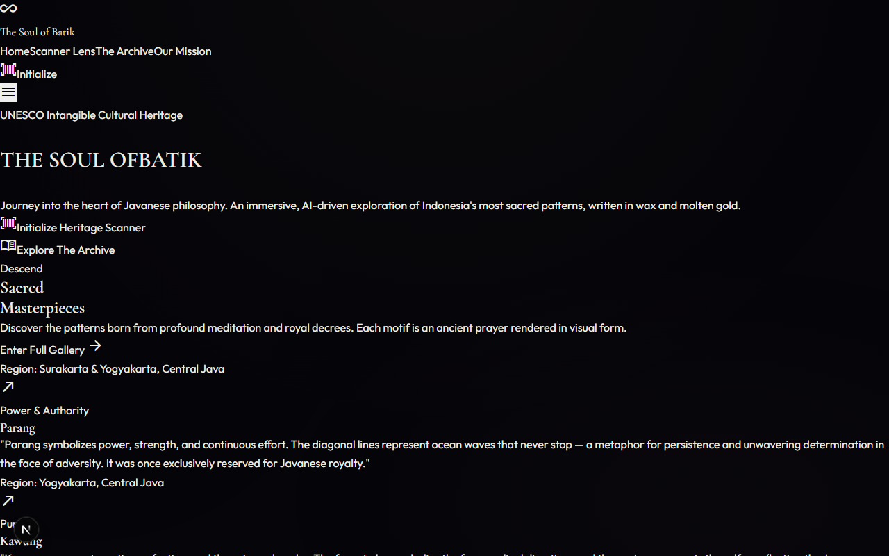
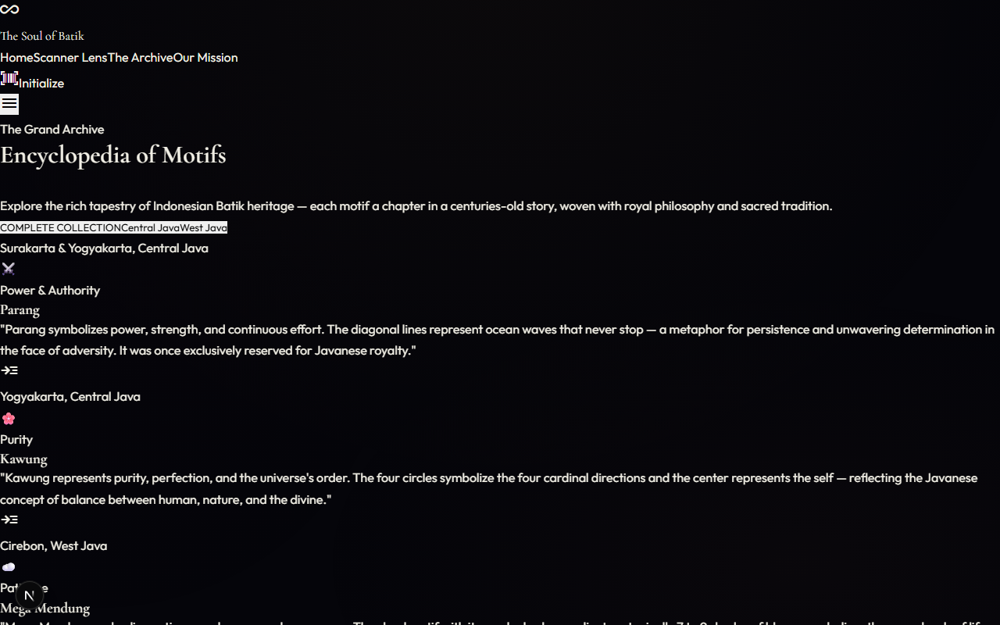
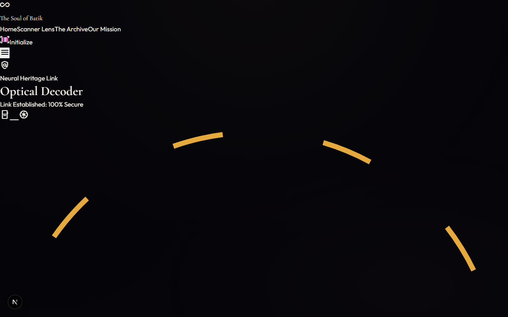
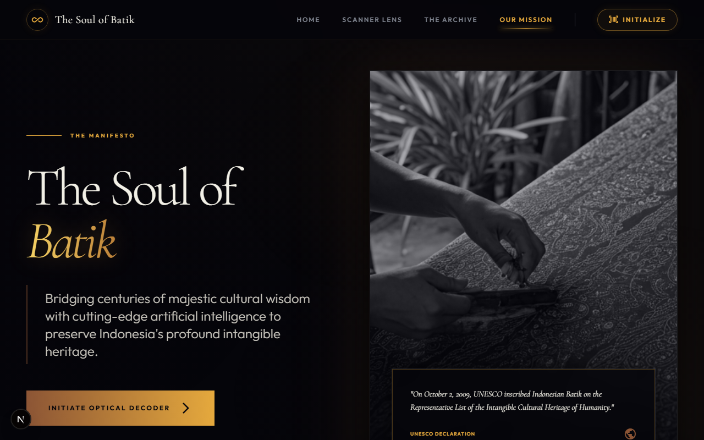

<h1 align="center">✦ THE SOUL OF BATIK ✦</h1>

<p align="center">
  
  
  
  
  
</p>

<p align="center">
  <i>"An immersive, AI-powered exploration of Indonesia's most sacred Batik patterns — written in wax and molten gold."</i>
</p>

---

<p align="center">
  
</p>

## Overview

The Soul of Batik is an immersive cultural gateway that bridges centuries-old Indonesian craftsmanship with modern machine learning. By utilizing advanced computer vision, the application empowers users to instantly decode the silent language of Batik motifs through a camera lens or image upload.

This project serves a critical cultural mission: to preserve and celebrate the UNESCO-listed intangible heritage of Indonesia. Each pattern is more than a design; it is a complex philosophical narrative. The app doesn't just recognize shapes; it uncovers the origin, history, and sacred symbolism embedded in every line and dot.

## Features

| Feature | Description |
| :--- | :--- |
| 🔍 **AI Pattern Scanner** | Uses a TensorFlow.js CNN to identify complex Batik motifs from live camera feeds or high-resolution uploads. |
| 📚 **Heritage Encyclopedia** | A curated digital archive of 10 primary motifs, complete with deep-dive philosophical analysis and historical context. |
| 🎙️ **Audio Narration** | Integrated text-to-speech engine providing elegant narration of each pattern’s unique history and spiritual meaning. |
| 🔒 **100% Edge Computing** | All neural network inference occurs directly on the user's device, ensuring maximum privacy and zero latency. |
| 🌏 **Cultural Preservation** | Dedicated to the digital archiving of Indonesian heritage following the 2009 UNESCO Intangible Cultural Heritage inscription. |
| ⚡ **Offline-Capable** | The lightweight TensorFlow.js model is loaded into the browser, allowing core features to function without a persistent server connection. |

## Screenshots

<table width="100%">
  <tr>
    <td width="50%"><br><p align="center">🏠 Homepage</p></td>
    <td width="50%"><br><p align="center">🗂️ The Archive</p></td>
  </tr>
  <tr>
    <td width="50%"><br><p align="center">🔬 Optical Decoder</p></td>
    <td width="50%"><br><p align="center">📜 Our Mission</p></td>
  </tr>
</table>

## The Batik Motifs Covered

| Motif | Origin | Philosophy | Symbolism |
| :--- | :--- | :--- | :--- |
| **Parang** | Surakarta & Yogyakarta | Represents the relentless power of nature and the ocean’s waves. | Power, persistence, royalty. |
| **Kawung** | Yogyakarta | Inspired by the fruit of the palm tree; represents a four-circle mandala of universal order. | Purity, perfection, cosmic harmony. |
| **Mega Mendung** | Cirebon | Features cloud-like forms with 7 to 9 layers of depth, reflecting the sky's vastness. | Patience, calmness, wisdom. |
| **Sekar Jagad** | Surakarta | A patchwork-style motif that expresses the beauty of global diversity. | Beauty of the world, unity, diversity. |
| **Truntum** | Surakarta | Scattered star-flower patterns originally created by a queen searching for her king's love. | Everlasting love, loyalty, devotion. |
| **Sido Mukti** | Central Java | Traditional wedding batik designed to bring a prosperous and joyful life. | Prosperity, nobility, happiness. |
| **Sido Luhur** | Surakarta | Reserved for court use; features stylized Garuda wings and mountain peaks. | Spiritual nobility, wisdom, leadership. |
| **Ceplok** | Yogyakarta | Symmetrical geometric shapes forming a structured, repetitive cosmic grid. | Order, cosmic balance, stability. |
| **Lereng** | Central Java | Diagonal bands representing life’s continuous journey and growth. | Continuous progress, persistence, growth. |
| **Sogan** | Surakarta | Characterized by its classic earth-tone palette using natural soga-tree dye. | Earthiness, warmth, humility. |

## Tech Stack

| Technology | Purpose | Version |
| :--- | :--- | :--- |
| **Next.js** | Core React framework with App Router architecture. | 16.x |
| **TypeScript** | Ensuring strict type safety across the AI pipeline and data layers. | 5.x |
| **TensorFlow.js** | In-browser machine learning inference engine for real-time detection. | 4.x |
| **TailwindCSS** | Utility-first styling for a refined, premium editorial aesthetic. | 3.x |
| **Cormorant Garamond** | Primary serif display font for a luxury, heritage feel. | Google Fonts |
| **Outfit** | Clean, geometric sans-serif for optimal body text legibility. | Google Fonts |
| **Web Speech API** | Delivering browser-native audio narration for an accessible experience. | W3C Standard |
| **MediaDevices API** | Handling high-resolution camera streams for the AI scanner. | W3C Standard |

## Architecture

The AI processing pipeline is designed for speed and privacy, operating entirely on the client side:

1. 📷 **Optical Capture** — Raw pixels are captured via the `MediaDevices API` from the live camera feed or a user-provided image.
2. 🧠 **CNN Inference** — A custom-trained MobileNetV2 model (optimized for 224×224 input) processes the image data directly in the browser.
3. 🔐 **Edge Processing** — TensorFlow.js manages the neural weights and executes inference without sending any visual data to external servers.
4. 📖 **Cultural Decode** — Upon a successful match, the system retrieves rich metadata (philosophy, origin, history) from a curated local dataset.
5. 🎙️ **Audio Output** — The `Web Speech API` synthesizes the text into an elegant narration, completing the multisensory experience.

## Getting Started

Follow these steps to set up the environment locally:

```bash
# Clone the repository
git clone https://github.com/yourusername/the-soul-of-batik.git
cd the-soul-of-batik

# Install dependencies
npm install

# Run the development server
npm run dev

# Open your browser
# Navigate to http://localhost:3000
```

## Project Structure

```text
src/
├── app/
│   ├── page.tsx            # Homepage — Hero, featured motifs, and cultural mission
│   ├── scanner/            # AI-powered pattern recognition interface
│   ├── gallery/            # The heritage encyclopedia (Full motif archive)
│   └── about/              # Detailed mission statement and technical architecture
├── components/
│   ├── Header.tsx          # Navigation and branding
│   ├── Footer.tsx          # Copyright and quick links
│   └── BatikDetailModal.tsx # The immersive motif detail overlay
├── data/
│   └── batikMotifs.ts      # Structured dataset of 10 motifs with cultural insights
└── lib/
    └── batikAnalyzer.ts    # TensorFlow.js inference engine and model loader
```

## Cultural Heritage Note

On October 2, 2009, UNESCO officially recognized Indonesian Batik as a Masterpiece of Oral and Intangible Heritage of Humanity. Batik is more than a textile; it is the spiritual fabric of Indonesia, woven into every stage of life—from birth to the final journey. Each line and color represents a prayer, a philosophy, and a profound connection to the divine.

This project is a digital tribute to that legacy. By using modern technology to illuminate ancient meanings, we hope to foster a deeper appreciation for the artisans of the past and ensure that the "Soul of Batik" continues to thrive in the digital age.

## License

This project is licensed under the [MIT License](LICENSE).
